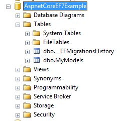

# ASP.NET Core with Entity Framework Core

In this repository I want to show the first steps with Entity Framework Core and ASP.NET Core.

The Repository contains a sample WebAPI with CRUD-Operations that you can Get/Read/Update and Delete "MyModel" objects through HTTP-calls.

## Before starting...

Please read this readme and think of executing ``` Add-Migration [MyMigrationName]``` and ```update-database``` in the Package Manager Console first.

The database should now be visible inside your SQL Server Management Studio.




## Run it...

If you now run the solution you can perform CRUD operations for example via postman, angular etc...


[ASP.NET Core Application to New Database](https://ef.readthedocs.io/en/latest/platforms/aspnetcore/new-db.html)
