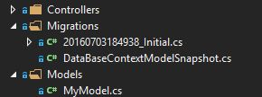
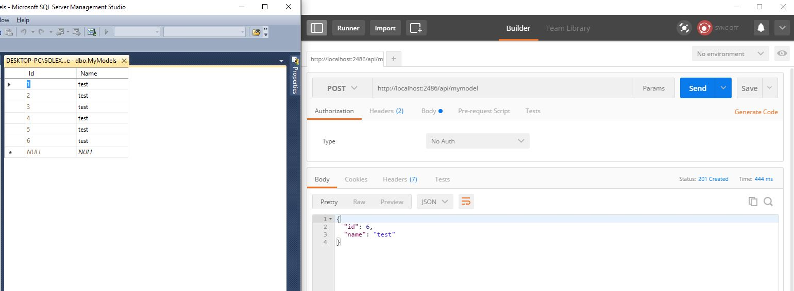

# ASP.NET Core 1.0 with Entity Framework Core

In this repository I want to show the first steps with Entity Framework Core and ASP.NET Core 1.0.

The Repository contains a sample WebAPI with CRUD-Operations that you can Get/Read/Update and Delete "MyModel" objects through HTTP-calls.

## Before starting...

Please read this readme and think of executing ``` Add-Migration [MyMigrationName]``` and ```update-database``` in the Package Manager Console first.

The database should now be visible inside your SQL Server Management Studio.




## Project.json

The project.json file includes tha Entity Framework SQLServer package as well as the EF Core itself and the EF Core Tools. The tools are mentioned twice: Once in the "dependencies"-section and once in the "tools"-section

```javascript

{
  "dependencies": {
    "Microsoft.NETCore.App": {
      "version": "1.0.0",
      "type": "platform"
    },
    "Microsoft.ApplicationInsights.AspNetCore": "1.0.0",
    "Microsoft.AspNetCore.Mvc": "1.0.0",
    "Microsoft.AspNetCore.Server.IISIntegration": "1.0.0",
    "Microsoft.AspNetCore.Server.Kestrel": "1.0.0",
    "Microsoft.Extensions.Configuration.EnvironmentVariables": "1.0.0",
    "Microsoft.Extensions.Configuration.FileExtensions": "1.0.0",
    "Microsoft.Extensions.Configuration.Json": "1.0.0",
    "Microsoft.Extensions.Logging": "1.0.0",
    "Microsoft.Extensions.Logging.Console": "1.0.0",
    "Microsoft.Extensions.Logging.Debug": "1.0.0",
    "Microsoft.Extensions.Options.ConfigurationExtensions": "1.0.0",
    "Microsoft.AspNetCore.StaticFiles": "1.0.0",
    "Microsoft.EntityFrameworkCore": "1.0.0",
    "Microsoft.EntityFrameworkCore.SqlServer": "1.0.0",
    "Microsoft.EntityFrameworkCore.Tools": {
      "version": "1.0.0-preview2-final",
      "type": "build"
    },
    "AutoMapper": "5.0.0"
  },

  "tools": {
    "Microsoft.AspNetCore.Server.IISIntegration.Tools": "1.0.0-preview2-final",
    "Microsoft.EntityFrameworkCore.Tools": "1.0.0-preview2-final"
  },

  "frameworks": {
    "netcoreapp1.0": {
      "imports": [
        "dotnet5.6",
        "portable-net45+win8"
      ]
    }
  },

  "buildOptions": {
    "emitEntryPoint": true,
    "preserveCompilationContext": true
  },

  "runtimeOptions": {
    "configProperties": {
      "System.GC.Server": true
    }
  },

  "publishOptions": {
    "include": [
      "wwwroot",
      "Views",
      "Areas/**/Views",
      "appsettings.json",
      "web.config"
    ]
  },

  "scripts": {
    "postpublish": [ "dotnet publish-iis --publish-folder %publish:OutputPath% --framework %publish:FullTargetFramework%" ]
  }
}


``` 

## Appsettings

The appsettings contain beside the well known logging section the connectionstring to target the database:

```javascript
{
  "Logging": {
    "IncludeScopes": false,
    "LogLevel": {
      "Default": "Debug",
      "System": "Information",
      "Microsoft": "Information"
    }
  },
  "ConnectionStrings": {
    "DefaultConnection": "Server=localhost\\SQLEXPRESS;Database=AspnetCoreEF7Example;Trusted_Connection=True;MultipleActiveResultSets=true;"
  }
}

```

This connectionstring is consumed in ...

## Startup

...the startup-file. With

```cs
var configurationSection = Configuration.GetSection("ConnectionStrings:DefaultConnection");
services.AddDbContext<DataBaseContext>(options => options.UseSqlServer(configurationSection.Value));
```
we can read the connectionstring and pass it to the "UseSQLServer"-Method.

## The Database Context

```cs
public class DataBaseContext : DbContext
{
    public DbSet<MyModel> MyModels { get; set; }

    public DataBaseContext(DbContextOptions<DataBaseContext> options)
        : base(options)
    { }
}
```

In the DbContext you pass the DbSet of your Entites as you are used to it when working with the Entity Framework also in previous versions. But see the new constructor EF Core introduces.

## Run it...

If you now run the solution you can perform CRUD operations for example via postman, angular etc...



[ASP.NET Core Application to New Database](https://ef.readthedocs.io/en/latest/platforms/aspnetcore/new-db.html)